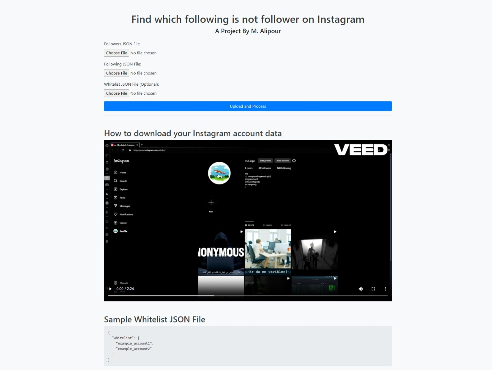

# Unique Following Finder

This Flask application allows you to find unique accounts that you are following across Instagram, excluding those who are already following you back or present in a whitelist.



## Usage

1. Clone the repository:

    ```bash
    git clone https://github.com/misteralipour/Instagram-Unfollower-Finder
    ```

2. Install dependencies:

    ```bash
    pip install Flask
    ```

3. Run the Flask application:

    ```bash
    python index.py
    ```

4. Open your web browser and navigate to `http://localhost:5000`.

5. Upload your followers and following JSON files, optionally include a whitelist JSON file.

How to get your followers and followings json:
https://raw.githubusercontent.com/misteralipour/Instagram-Unfollower-Finder/main/static/tutorial.mp4

6. Click on the "Upload and Process" button to process the files.

7. Once processed, the application will generate an HTML file containing the unique accounts you are following. You can download this file to view the results.

## File Structure

- `index.py`: Contains the Flask application code.
- `uploads/`: Directory where uploaded files are stored temporarily.
- `templates/`: Directory containing HTML templates for the web interface.

## Requirements

- Python 3.x
- Flask
- json

## Acknowledgements

This project is inspired by the need to analyze social media following data in a convenient manner.
